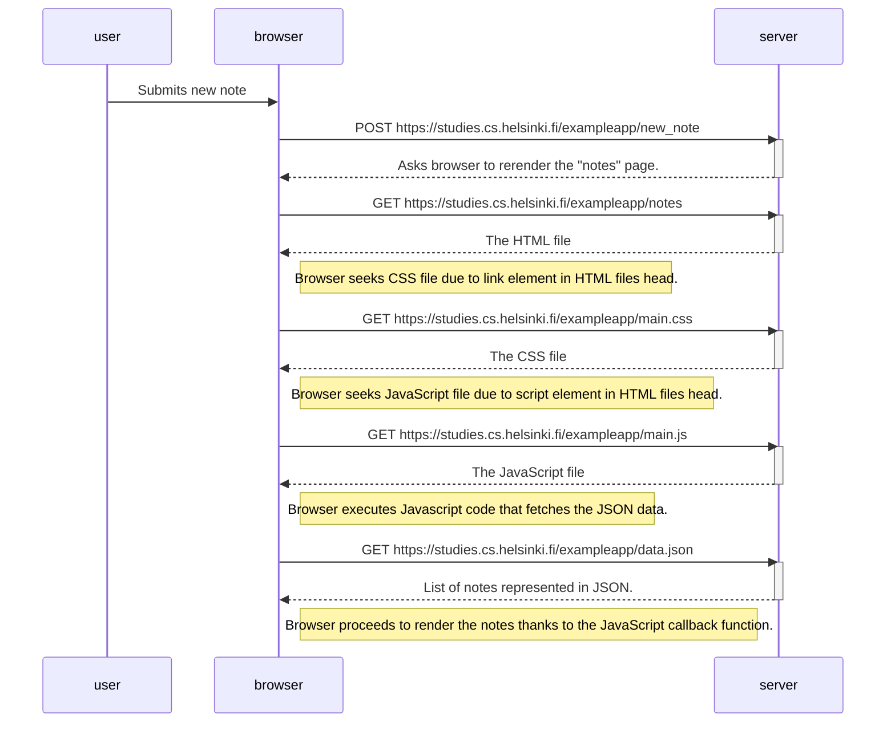

```mermaid
sequenceDiagram
    participant user
    participant browser
    participant server

    user->>browser: Submits new note

    browser->>server: POST https://studies.cs.helsinki.fi/exampleapp/new_note
    activate server
    server-->>browser: Asks browser to rerender the "notes" page.
    deactivate server

    browser->>server: GET https://studies.cs.helsinki.fi/exampleapp/notes
    activate server
    server-->>browser: The HTML file
    deactivate server

    Note right of browser: Browser seeks CSS file due to link element in HTML files head.

    browser->>server: GET https://studies.cs.helsinki.fi/exampleapp/main.css
    activate server
    server-->>browser: The CSS file
    deactivate server

    Note right of browser: Browser seeks JavaScript file due to script element in HTML files head.

    browser->>server: GET https://studies.cs.helsinki.fi/exampleapp/main.js
    activate server
    server-->>browser: The JavaScript file
    deactivate server

    Note right of browser: Browser executes Javascript code that fetches the JSON data.

    browser->>server: GET https://studies.cs.helsinki.fi/exampleapp/data.json
    activate server
    server-->>browser: List of notes represented in JSON.
    deactivate server

    Note right of browser: Browser proceeds to render the notes thanks to the JavaScript callback function.
```