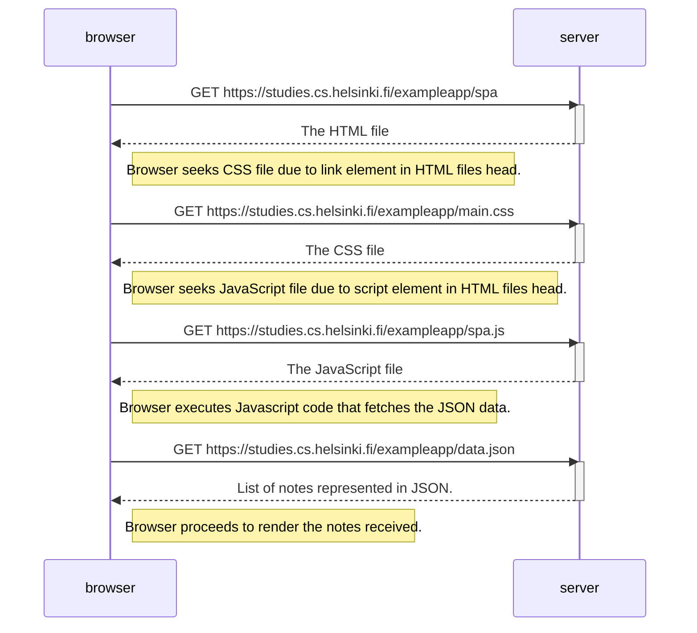

```mermaid
sequenceDiagram
    participant browser
    participant server

    browser->>server: GET https://studies.cs.helsinki.fi/exampleapp/spa
    activate server
    server-->>browser: The HTML file
    deactivate server

    Note right of browser: Browser seeks CSS file due to link element in HTML files head.

    browser->>server: GET https://studies.cs.helsinki.fi/exampleapp/main.css
    activate server
    server-->>browser: The CSS file
    deactivate server

    Note right of browser: Browser seeks JavaScript file due to script element in HTML files head.

    browser->>server: GET https://studies.cs.helsinki.fi/exampleapp/spa.js
    activate server
    server-->>browser: The JavaScript file
    deactivate server

    Note right of browser: Browser executes Javascript code that fetches the JSON data.

    browser->>server: GET https://studies.cs.helsinki.fi/exampleapp/data.json
    activate server
    server-->>browser: List of notes represented in JSON.
    deactivate server

    Note right of browser: Browser proceeds to render the notes received.
```