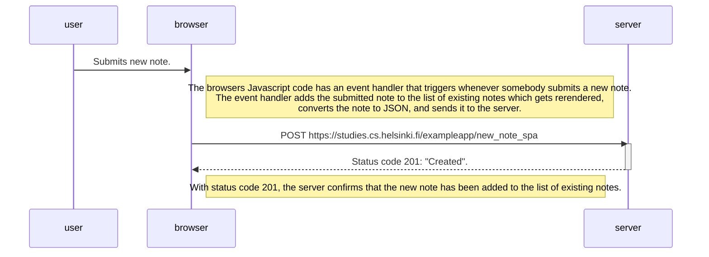

```mermaid

sequenceDiagram
    participant user
    participant browser
    participant server

    user->>browser: Submits new note.

    Note right of browser: The browsers Javascript code has an event handler that triggers whenever somebody submits a new note. <br/> The event handler adds the submitted note to the list of existing notes which gets rerendered, <br/> converts the note to JSON, and sends it to the server.

    browser->>server: POST https://studies.cs.helsinki.fi/exampleapp/new_note_spa
    activate server
    server-->>browser: Status code 201: "Created".
    deactivate server

    Note right of browser: With status code 201, the server confirms that the new note has been added to the list of existing notes.


```